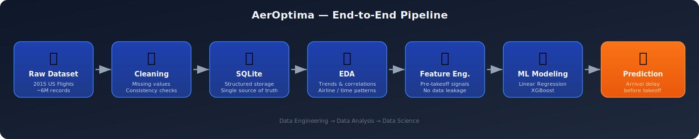
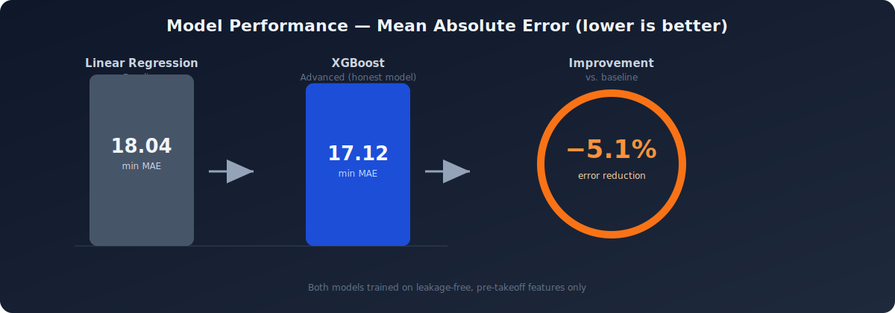

# **AerOptima** ✈️

## **An End-to-End Data Project for Flight Delay Prediction**

[](./Images/AerOptima%20cover.png)


## 🎯 The Problem

Flight delays are costly and hard to anticipate for passengers planning connections, and for airlines managing operations. Most delay data is only known *after* the fact, which makes it useless for real decision-making.

**AerOptima predicts a flight's arrival delay using only information available *before* takeoff**, no cheating with post-departure data, no unrealistic accuracy. Just an honest, deployable-grade model built the way a real airline data team would build one.


## 🧭 The Approach

The project follows a complete, realistic data pipeline, from raw records to a trained predictive model, with a strong emphasis on avoiding **data leakage** at every stage.



1. **Data Engineering:** ingest and clean ~6M raw flight records, store them in SQLite for consistent access.
2. **Data Analysis (EDA):** uncover patterns in delays by airline, day of week, and month.
3. **Feature Engineering:** keep only variables known *before* takeoff, deliberately excluding "future" fields (e.g. `WHEELS_ON`, `AIR_SYSTEM_DELAY`) that would leak the answer.
4. **Machine Learning:** train and compare a Linear Regression baseline against an XGBoost model.


## 📈 Results



- **Initial (leaky) models** looked great on paper: MAE of ~3.5 min but only because they secretly had access to post-flight information.
- Once **data leakage was removed**, both models were retrained on strictly pre-takeoff features: **Linear Regression** reached an MAE of **18.04 min**, while **XGBoost** improved on it with an MAE of **17.12 min** (**-5.1%** error).
- **Takeaway:** once the leaky "future" variables are gone, flight delay becomes a genuinely hard forecasting problem, most of the remaining error comes from irreducible noise (weather, ATC, one-off disruptions) rather than model choice. XGBoost captures a real but modest edge over a simple linear baseline, which itself is a meaningful and honest result.


## 📂 Repository Structure

The project is organized into three main pillars:

### 👨‍🔬 Data Engineering

```
├── 📁 Data Engineer
│   ├── 🐍 Data_Engineer.py
│   └── 📄 Data_engineer.ipynb
```

- **Folder:** `Data Engineer/`
- **Key Files:** `Data_Engineer.py`, `Data_engineer.ipynb`
- **Objective:** Ingestion and cleaning of raw aviation datasets.
- **Tasks:** Handling missing values, database management (SQLite), and initial feature preparation to ensure data consistency across the pipeline.

### 📊 Data Analysis

```
├── 📁 Data Analyst
│   ├── 📁 Exports
│   │   ├── 🖼️ Average delay per day of week.png
│   │   ├── 🖼️ Change in average delay per month.png
│   │   ├── 🖼️ Correlation matrix.png
│   │   ├── 🖼️ Delay distribution.png
│   │   ├── 🖼️ Link departure and arrival delay.png
│   │   ├── 🖼️ Mean delay for each airline.png
│   │   └── 🖼️ Occurence of airlines.png
│   └── 📄 Data_Analyst.ipynb
```

- **Folder:** `Data Analyst/`
- **Key Files:** `Data_Analyst.ipynb`, `Exports/`
- **Objective:** Uncovering trends and correlations in flight data.
- **Highlights:**
  - Analysis of delays by **airline performance**.
  - Temporal patterns (delay distribution by **day of the week** and **month**).

[](/Nathan-Houel/AerOptima/blob/main/Data%20Analyst/Exports/Average%20delay%20per%20day%20of%20week.png)
*Insight: Flight delays fluctuate significantly depending on the day of the week, revealing patterns in air traffic congestion.*

### 🤖 Data Science

```
├── 📁 Data Scientist
│   ├── 🖼️ Actual flights vs forecasts.png
│   └── 📄 Data Scientist.ipynb
```

- **Folder:** `Data Scientist/`
- **Key Files:** `Data Scientist.ipynb`
- **Objective:** Building a robust predictive model.
- **Models used:** Linear Regression (Baseline) and **XGBoost** (Advanced).
- **The "Honest Model" Approach:** A major focus of this project was identifying and removing **Data Leakage**. We strictly eliminated "future variables" (like `AIR_SYSTEM_DELAY` or `WHEELS_ON`) to ensure the model makes genuine predictions.

[](/Nathan-Houel/AerOptima/blob/main/Data%20Scientist/Actual%20flights%20vs%20forecasts.png)
*Result: Our final "honest" XGBoost model (red) successfully anticipates the baseline structural delays (the signal) while correctly ignoring unpredictable, exceptional spikes (the noise).*


## 🗄️ The Dataset

The data powering this project comes from the **2015 Flight Delays and Cancellations** dataset, originally collected by the U.S. Department of Transportation (DOT) and hosted on Kaggle.

- **Source:** [Kaggle: US Flight Delays Dataset](https://www.kaggle.com/datasets/usdot/flight-delays)
- **Scope:** It contains detailed information on nearly 6 million commercial flights operated by US airlines in 2015.
- **Features:** The dataset includes scheduled and actual departure/arrival times, airlines, origin/destination airports, flight distances, and detailed delay causes (which we meticulously filtered to avoid data leakage).

## 🚀 Technical Stack

- **Language:** Python 3.13.9
- **Data Handling:** Pandas, NumPy, SQLite
- **Visualization:** Matplotlib, Seaborn
- **Machine Learning:** Scikit-Learn, **XGBoost** (GPU accelerated)

## 👤 Author

Project created by Nathan Houel - *April 2026*.
